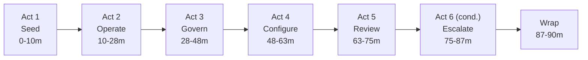

# Workshop Kit Templates

Copy-and-adapt skeletons for the four files every Splunk workshop kit produces. Ordered top-to-bottom in the order the agent should write them.

---

## 1. `bin/scenarios.py`

Stdlib-only. Each scenario is a function that takes `base_factory(t) -> dict`, an `rng`, and a `(start, end)` window, and returns a list of overlaid event dicts.

```python
"""Workshop planted incidents for <APP>.

Each scenario function takes:
- a callable ``base_factory(t: datetime) -> dict`` returning a baseline raw event,
- a deterministic ``random.Random`` instance,
- the time window ``(start, end)`` the workshop is replaying.

Returns a list of event dicts with the incident overlay applied. The main
generator merges these with baseline events and writes the JSONL.

No external deps; stdlib only.
"""

from __future__ import annotations

import uuid
from datetime import datetime, timedelta
from typing import Callable, Dict, List, Tuple


def _scattered(rng, start: datetime, end: datetime, n: int) -> List[datetime]:
    span = (end - start).total_seconds()
    return sorted(start + timedelta(seconds=rng.uniform(0, span)) for _ in range(n))


def detection_class_a(
    base_factory: Callable[[datetime], Dict],
    rng,
    window: Tuple[datetime, datetime],
    count: int = 60,
) -> List[Dict]:
    """Scattered events that trigger detection class A. Each carries both the
    rule-engine flags the TA aliases AND the ML score fields the dashboard
    shows directly."""
    start, end = window
    events: List[Dict] = []
    for t in _scattered(rng, start, end, count):
        evt = base_factory(t)
        # rule-engine flags (aliased by the TA → use raw underscore form)
        evt["<rule_flag>"] = True
        evt["<rule_categories>"] = ["<category_a>", "<category_b>"]
        # ML scores (no FIELDALIAS → emit dotted form directly)
        score = round(rng.uniform(0.78, 0.99), 4)
        evt["<gen_ai>.<class_a>.risk_score"] = score
        evt["<gen_ai>.<class_a>.ml_detected"] = "true"
        evt["<gen_ai>.<class_a>.confidence"] = "high" if score < 0.92 else "very_high"
        events.append(evt)
    return events


def detection_class_b_burst(
    base_factory: Callable[[datetime], Dict],
    rng,
    window: Tuple[datetime, datetime],
    count: int = 30,
    burst_minutes: int = 10,
) -> List[Dict]:
    """All events from a single source within a sub-window in the latter half.
    Test with --backfill-minutes 5 to verify the placement math doesn't
    overrun the window start."""
    start, end = window
    span = (end - start).total_seconds()
    burst_seconds = min(burst_minutes * 60, max(60, int(span * 0.6)))
    earliest = max(0.0, span * 0.45)
    latest = max(earliest, span - burst_seconds - 30)
    offset = rng.uniform(earliest, latest) if latest > earliest else earliest
    burst_start = start + timedelta(seconds=offset)
    burst_end = min(end, burst_start + timedelta(seconds=burst_seconds))

    attacker_ip = "203.0.113.{}".format(rng.randint(7, 250))
    attacker_session = str(uuid.UUID(int=rng.getrandbits(128)))

    events: List[Dict] = []
    for t in _scattered(rng, burst_start, burst_end, count):
        evt = base_factory(t)
        evt["client_address"] = attacker_ip
        evt["session_id"] = attacker_session
        evt["<rule_flag>"] = True
        evt["<gen_ai>.<class_b>.risk_score"] = round(rng.uniform(0.82, 0.98), 4)
        evt["<gen_ai>.<class_b>.ml_detected"] = "true"
        events.append(evt)
    return events


def operational_outlier(
    base_factory: Callable[[datetime], Dict],
    rng,
    window: Tuple[datetime, datetime],
    count: int = 25,
    spike_minutes: int = 15,
) -> List[Dict]:
    """Events confined to the last ``spike_minutes``. Clamp to window start
    so very short backfills don't underflow."""
    start, end = window
    spike_start = max(start, end - timedelta(minutes=spike_minutes))
    events: List[Dict] = []
    for t in _scattered(rng, spike_start, end, count):
        evt = base_factory(t)
        # set the operational fields the dashboard panel reads
        evt["<expensive_metric>"] = rng.randint(20_000, 24_000)
        events.append(evt)
    return events


def inject_all(
    base_factory: Callable[[datetime], Dict],
    rng,
    window: Tuple[datetime, datetime],
) -> Dict[str, List[Dict]]:
    return {
        "detection_class_a": detection_class_a(base_factory, rng, window),
        "detection_class_b_burst": detection_class_b_burst(base_factory, rng, window),
        "operational_outlier": operational_outlier(base_factory, rng, window),
    }
```

---

## 2. `bin/gen_<domain>_events.py`

```python
#!/usr/bin/env python3
"""Workshop backfill generator for <APP>.

Produces a JSONL file of synthetic raw events covering the prior
``--backfill-minutes`` window (default 60). Designed to be ingested into
``index=<INDEX>`` via Splunk Web's "Add Data → Upload" wizard.

Usage:
    python3 bin/gen_<domain>_events.py --out /tmp/<domain>_backfill.jsonl

Optional environment:
    COMPANY_NAME   Cosmetic re-skin of tenant strings (default "<DEFAULT>").
"""

from __future__ import annotations

import argparse
import json
import os
import random
import sys
import uuid
from datetime import datetime, timedelta, timezone
from pathlib import Path
from typing import Dict, List

sys.path.insert(0, str(Path(__file__).resolve().parent))
import scenarios  # noqa: E402


COMPANY_NAME = os.environ.get("COMPANY_NAME", "<DEFAULT>").strip() or "<DEFAULT>"


def _new_uuid(rng): return str(uuid.UUID(int=rng.getrandbits(128)))
def _client_ip(rng): return ".".join(str(rng.randint(1, 254)) for _ in range(4))


def make_base_factory(rng: random.Random):
    """Return ``base_factory(t)`` producing a fresh, *clean* raw event.

    Every field below MUST match a real raw key the target's
    [stanza] in default/props.conf either aliases or auto-extracts via
    KV_MODE=json. Read the props.conf BEFORE filling this in.
    """
    apps = [
        "<spike-target-app>",                    # operational outlier target (keep at index 0)
        f"{COMPANY_NAME.lower()}-<app2>",
        f"{COMPANY_NAME.lower()}-<app3>",
    ]

    def base_factory(t: datetime) -> Dict:
        return {
            # core identity (raw underscore form — TA aliases these)
            "operation_name": "<op>",
            "provider_name": "<provider>",
            "request_model": "<model>",
            "response_model": "<model>",
            "request_id": _new_uuid(rng),
            "session_id": _new_uuid(rng),
            "event_id": _new_uuid(rng),
            "trace_id": _new_uuid(rng),
            # payload
            "input_messages": [{"role": "user", "content": "<safe_prompt>"}],
            "output_messages": [{"role": "assistant", "content": "<safe_response>"}],
            # usage / perf / cost
            "usage_input_tokens": rng.randint(200, 800),
            "usage_output_tokens": rng.randint(100, 500),
            "client_operation_duration": round(rng.uniform(0.3, 2.5), 4),
            "cost": round(rng.uniform(0.001, 0.05), 6),
            # governance flags (clean defaults)
            "<rule_flag>": False,
            "<rule_categories>": [],
            # service / endpoint
            "service_name": rng.choice(apps),
            "client_address": _client_ip(rng),
            "status": "success",
            # ML score baselines (dotted form — no FIELDALIAS for these)
            "<gen_ai>.<class_a>.risk_score": round(rng.uniform(0.0, 0.18), 4),
            "<gen_ai>.<class_a>.ml_detected": "false",
            "<gen_ai>.<class_b>.risk_score": round(rng.uniform(0.0, 0.15), 4),
            "<gen_ai>.<class_b>.ml_detected": "false",
            # canonical timestamp
            "timestamp": t.isoformat(timespec="microseconds"),
        }

    return base_factory


def _parse_args(argv):
    p = argparse.ArgumentParser(description="Generate JSONL backfill for the <APP> workshop.")
    p.add_argument("--out", required=True, help="Output JSONL path.")
    p.add_argument("--backfill-minutes", type=int, default=60)
    p.add_argument("--rate", type=int, default=50, help="Avg baseline events per minute.")
    p.add_argument("--seed", type=int, default=4242, help="RNG seed for reproducibility.")
    p.add_argument("--no-incidents", action="store_true", help="Smoke-test mode (baseline only).")
    p.add_argument("--end", default=None, help="ISO 8601 end of window (default: now).")
    return p.parse_args(argv)


def _resolve_end(value):
    if value is None:
        return datetime.now(timezone.utc).replace(microsecond=0)
    dt = datetime.fromisoformat(value)
    return dt if dt.tzinfo else dt.replace(tzinfo=timezone.utc)


def main(argv=None):
    args = _parse_args(argv if argv is not None else sys.argv[1:])
    out_path = Path(args.out).resolve()
    out_path.parent.mkdir(parents=True, exist_ok=True)
    rng = random.Random(args.seed)
    end = _resolve_end(args.end)
    start = end - timedelta(minutes=args.backfill_minutes)
    base_factory = make_base_factory(rng)

    baseline = []
    span = (end - start).total_seconds()
    for _ in range(max(1, args.rate * args.backfill_minutes)):
        u = rng.random() ** 0.85          # slight bias toward recent
        t = start + timedelta(seconds=u * span)
        baseline.append(base_factory(t))

    scen = {} if args.no_incidents else scenarios.inject_all(base_factory, rng, (start, end))

    all_events = list(baseline)
    for evts in scen.values():
        all_events.extend(evts)
    all_events.sort(key=lambda e: e["timestamp"])

    with out_path.open("w", encoding="utf-8") as fh:
        for evt in all_events:
            fh.write(json.dumps(evt, separators=(",", ":")))
            fh.write("\n")

    print(f"wrote {len(all_events)} events to {out_path}")
    print(f"  window: {start.isoformat()} -> {end.isoformat()}")
    print(f"  baseline: {len(baseline)} events at ~{args.rate} ev/min")
    if scen:
        print("  planted incidents:")
        for name, evts in scen.items():
            print(f"    - {name}: {len(evts)} events")
    print(f"  COMPANY_NAME = {COMPANY_NAME!r}")
    return 0


if __name__ == "__main__":
    raise SystemExit(main())
```

---

## 3. `bin/run_<domain>_backfill.sh`

```bash
#!/usr/bin/env bash
# Thin wrapper around bin/gen_<domain>_events.py.
# Usage: bin/run_<domain>_backfill.sh --out /tmp/<domain>_backfill.jsonl
set -euo pipefail

SCRIPT_DIR="$(cd -- "$(dirname -- "${BASH_SOURCE[0]}")" >/dev/null 2>&1 && pwd)"
GEN_PY="${SCRIPT_DIR}/gen_<domain>_events.py"

[[ -f "${GEN_PY}" ]] || { echo "fatal: cannot locate ${GEN_PY}" >&2; exit 1; }

if [[ -n "${PYTHON:-}" ]]; then
  PY="${PYTHON}"
elif command -v python3 >/dev/null 2>&1; then
  PY="$(command -v python3)"
elif [[ -x "${SPLUNK_HOME:-/opt/splunk}/bin/python3" ]]; then
  PY="${SPLUNK_HOME:-/opt/splunk}/bin/python3"
else
  echo "fatal: no python3 found in PATH and \$SPLUNK_HOME/bin/python3 missing" >&2
  exit 1
fi

# require --out somewhere in argv
HAS_OUT=0
for arg in "$@"; do
  [[ "${arg}" == "--out" || "${arg}" == --out=* ]] && { HAS_OUT=1; break; }
done
if [[ "${HAS_OUT}" -eq 0 ]]; then
  echo "usage: $(basename "$0") --out <path.jsonl> [--backfill-minutes N] [--rate N] [--seed N] [--no-incidents]" >&2
  exit 2
fi

echo "running: ${PY} ${GEN_PY} $*"
exec "${PY}" "${GEN_PY}" "$@"
```

After writing, `chmod +x bin/run_<domain>_backfill.sh bin/gen_<domain>_events.py`.

---

## 4. `WORKSHOP_OUTLINE.md` skeleton

```markdown
# <Workshop title> — Workshop Outline

Presenter narrative and customer prep doc for the <length>-minute hands-on
workshop on [`<APP>`](/opt/splunk/etc/apps/<APP>). Pair this file with
[`WORKSHOP_GUIDE.md`](WORKSHOP_GUIDE.md) for the click-by-click drive script.

## Quick reference

| | |
|---|---|
| **Length** | <N> min (Act <X> conditional on <integration>; without it, runs <N-X> min) |
| **Audience** | <persona> |
| **Prereqs** | <APP> installed + enabled, `<index>` index exists, <dependency> configured |
| **Outcome** | The customer leaves having seen <three concrete things> with their own eyes |
| **Workshop kit** | `/opt/splunk/etc/apps/<APP>_workshop/` |

## Narrative



## Acts

### Act 0 — Frame the demo (1 min)

> *<one-sentence business message>*

**Goal.** <what the participant proves>

**Beats.**
1. <beat 1>
2. <beat 2>

[... one block per act ...]

## Outcomes
- <takeaway 1>
- <takeaway 2>
- <takeaway 3>

## Constraints
- No edits to <APP>. The kit is sibling, not child.
- Conditional acts: <list>.
- <other constraints>
```

---

## 5. `WORKSHOP_GUIDE.md` skeleton

Per-act-stage block — repeat this exact shape for every stage:

```markdown
### Stage <N.M> — <stage title> (<start>-<end> min)

#### Click path

1. Splunk Web → top nav **Apps** → **<App display name>**.
2. App nav → **Dashboards → <Dashboard display name>** ([`<view>.xml`](/opt/splunk/etc/apps/<APP>/default/data/ui/views/<view>.xml)).
3. Set time range to **`Last <N> minutes`**.
4. <next click>

#### Exact SPL

\`\`\`spl
index=<INDEX> earliest=-<N>m
| <pipeline that proves the point>
\`\`\`

#### What you see

- <expected panel value or row count>
- <visual cue, e.g. one slice dominates the donut>
- <color / numeric threshold>

#### Things to point at

- <product capability 1>
- <product capability 2>

#### Say out loud

> *"<verbatim presenter narration tied to the planted incident the participant just saw>"*

#### Common gotchas

- **<symptom>** — <fix in one line>
- **<symptom>** — <fix in one line>
```

Add a top-of-file **Pre-flight checklist** with `| rest /services/...` health checks for: Splunk version, target app enabled (`disabled=0`), target index exists, dependent apps installed, optional integrations.

---

## Smoke-test checklist

After all four files exist and the runner is `chmod +x`:

```bash
cd <APP>_workshop

# 1. Baseline shape
bin/run_<domain>_backfill.sh --out /tmp/sm_baseline.jsonl --backfill-minutes 5 --rate 5 --no-incidents

# 2. Default workshop run
bin/run_<domain>_backfill.sh --out /tmp/sm_default.jsonl

# 3. Short window (catch sub-window underflow bugs)
bin/run_<domain>_backfill.sh --out /tmp/sm_short.jsonl --backfill-minutes 5 --rate 5

# 4. Cosmetic re-skin
COMPANY_NAME='AcmeCo' bin/run_<domain>_backfill.sh --out /tmp/sm_skin.jsonl --backfill-minutes 5
```

Then in Python, assert for `sm_default.jsonl`:
- `len(events) ≈ rate * minutes + sum(scenario counts)`
- Every event has the required raw-field keys for the target sourcetype
- Each scenario count matches the value passed to the corresponding scenario function
- The operational outlier's timestamps are confined to `[end - spike_minutes, end]`
- The burst's events all share one `client_address`
- At least one event per scenario has the dotted ML field set with a non-default value

For `sm_baseline.jsonl`, assert no event has any rule flag = True.

For `sm_skin.jsonl`, assert tenant strings reflect `COMPANY_NAME`.

If a Splunk MCP is connected: ingest the JSONL via the MCP, run `index=<INDEX> earliest=-1h | head 1 | table _time <gen_ai.*>`, and confirm every aliased field populates and at least one scheduled saved search the workshop demonstrates fires when its query runs over the backfill window.
